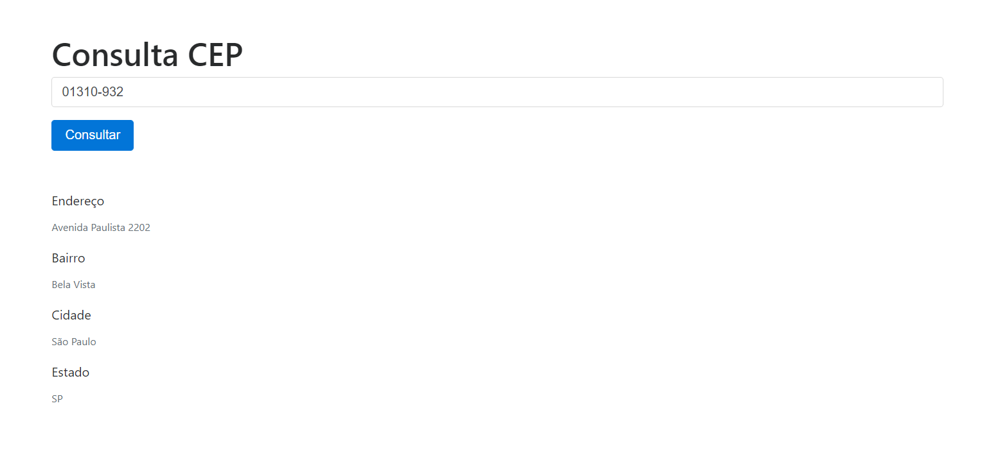

# Descrição
Aplicação em Angular 11 que consulta o CEP, consumindo Webservice (API REST JSON) do site www.viacep.com.br.

# Demonstração
Link para visualizar/testar: https://carlosmorais.github.io/Consultar-CEP-com-Angular-11/dist/prod/

 

## WEBSERVICE
https://viacep.com.br/ws/01001000/json/

1. ng generate component endereco
2. endereco.ts
3. ng generate service service\endereco
4. Registrar EnderecoService em Providers (app.module.ts)
5. Registrar FormsModule, HttpClientModule em imports (app.module.ts)
6. endereco.service.ts 
7. endereco.component.ts
8. endereco.component.html

# Consultar-CEP-com-Angular-11
This project was generated with [Angular CLI](https://github.com/angular/angular-cli) version 11.0.5.

## Development server

Run `ng serve` for a dev server. Navigate to `http://localhost:4200/`. The app will automatically reload if you change any of the source files.

## Code scaffolding

Run `ng generate component component-name` to generate a new component. You can also use `ng generate directive|pipe|service|class|guard|interface|enum|module`.

## Build

Run `ng build` to build the project. The build artifacts will be stored in the `dist/` directory. Use the `--prod` flag for a production build.

## Running unit tests

Run `ng test` to execute the unit tests via [Karma](https://karma-runner.github.io).

## Running end-to-end tests

Run `ng e2e` to execute the end-to-end tests via [Protractor](http://www.protractortest.org/).

## Further help

To get more help on the Angular CLI use `ng help` or go check out the [Angular CLI Overview and Command Reference](https://angular.io/cli) page.

